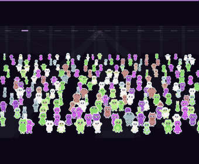

# Unifind

A js13kGames 2026 entry for the Unicorns and Rainbows theme, also submitted to
the Wavedash challenge.

Unifind is a hidden-object game on a beat. One unicorn hides in a crowd of
creatures dancing in time, in a nightclub or at an open-air party, and you have
to spot it before the track ends. Everything is generated by code: no images, no
sampled audio, no dependencies, no external resources.

One room, its crowd, and the unicorn found before the music runs out.

## Controls

One gesture: click, or tap. Wheel and pinch to zoom, drag to move around the
room.

## What is in the game

- 9 rooms: Warehouse, Meadow, Subwoofer, Beach, Bunker, Forest, Neon, Rooftop,
  Lounge
- 9 tracks, one per room: techno, melodic house, dubstep, trance, drum and bass,
  psytrance, synthwave, UK garage, deep house
- 10 creature species, drawn by a single function from a table of 16 numbers per
  species
- A rising crowd: 200 creatures in room 1, 100 more per room, capped at 1000
- The music is the hourglass: every track runs 32 bars, which is 44 to 70 seconds
  depending on the tempo
- 9 achievements and one leaderboard, both shown on Wavedash

## Layout

    src/creatures.js   creature generation (silhouettes, palettes, sticker style)
    src/music.js       audio engine, 9 tracks, sections and choruses
    src/rooms.js       the 9 rooms, lighting, crowd, shuffling
    src/wavedash.js    achievements, leaderboard, reward banner
    src/game.js        game loop, camera, input, screens

    build.js           builds the three artefacts from one state of src/
    wavedash.toml      Wavedash challenge configuration
    wavedash-achievements.json   definitions to import in the Developer Portal

    tools/dom.js       fake DOM shared by the test tools
    tools/check.js     plays a full round, on the source or on the terser output
    tools/wavedash.js  the Wavedash integration, against a type-checking double SDK
    tools/audio.js     walks the 9 tracks and inspects the audio chain
    tools/capture-driver.js   capture driver that regenerates media/gameplay.gif

    media/             cover, thumbnail and GIF for the submission

## Build

    npm install              # only needed for the test tools
    npm run build            # the three artefacts, one roadroller draw
    npm run release          # same, best of six draws: this is the ZIP to submit
    npm run fast             # no compression, into dist/tuning/, leaves the ZIP alone

The build produces, from the same state of `src/`:

    unifind.zip              the contest archive, zip -9 then advzip
    dist/js13k/index.html    the compressed page, terser + roadroller
    dist/wavedash/index.html the readable page, no minification: the Wavedash target

Development happens in `src/`. Everything under `dist/` is a build product and
should never be edited by hand.

Tools expected on the machine: `terser` and `roadroller` (the build looks in
`node_modules/.bin` first, then globally), and `advzip` from AdvanceCOMP for the
final recompression. The build works without advzip, but the archive comes out
about 300 bytes heavier.

## Check

    npm run check

Runs four checks in a row:

    node tools/check.js          a full round on the readable page
    node tools/check.js --min    the same checks on the terser output
    node tools/wavedash.js       the Wavedash integration, on the terser output
    node tools/audio.js          9 tracks over 32 bars, frequency ranges

`tools/check.js` also guards two invariants that have already regressed during
development: the depth order of the creatures, which must sort on the foot line,
and the confinement of the confetti inside the room.

The `--min` mode and `tools/wavedash.js` exist because a minification option can
change a computation or break an API call without writing anything to the
console: the game then works from the source but not from the ZIP. The double
SDK in `tools/wavedash.js` rejects wrong argument types exactly like the real
one, and counts successful calls instead of trusting a quiet console.

## Regenerating the GIF

`media/gameplay.gif` is captured, not filmed: the game runs with a fixed seed for
`Math.random` and a forced time step, so two captures produce the same file.
`tools/capture-driver.js` walks through the screens, then points at the unicorn
by calling `tap(x, y)` the way a player would.

## Wavedash

The challenge is a checkbox on the same js13k entry, not a second submission. The
platform injects the `Wavedash` global before the game code: `src/wavedash.js`
loads nothing, bundles nothing, and stays completely inert anywhere else. On
js13kgames.com the game sees no global and behaves exactly the same. Only the
achievement banner, painted into the canvas, shows up everywhere.

The 9 achievements must exist in the Developer Portal **before** the game fires
them: the SDK silently ignores an unknown identifier. Import them from
`wavedash-achievements.json` (Achievements, then Add achievement, then Import
JSON), then confirm with `wavedash achievement list`.

The `night-score` leaderboard is created on the first won round, descending
order, number type. Every cleared room pays out:

    level x (seconds of music saved + 200)

The flat 200 makes progress always worth something, even on a late find. The
`level` factor makes a far room worth much more than an easy one. The total
accumulates over the session, so the leaderboard rewards speed and depth at
once. A player who replays the same room forever keeps accumulating: that is a
deliberate choice, real time spent is the limit.

## Size budget

The contest limit is 13312 zipped bytes.

`npm run release` prints the size it reached. Do not trust a number written down
here: roadroller searches its parameters at random, and two builds of the same
source differ by a few dozen bytes. That is why `release` keeps the best of six
draws, and why the size to read is the one printed by the build being submitted.

Measured costs, useful when trading features against bytes:

    one room (scenery)           200 to 250 bytes
    one track                     60 bytes
    5 creature species           108 bytes
    coat patterns                 93 bytes
    party props                  159 bytes
    9 achievements and banner    ~390 bytes
    the leaderboard               ~45 bytes
